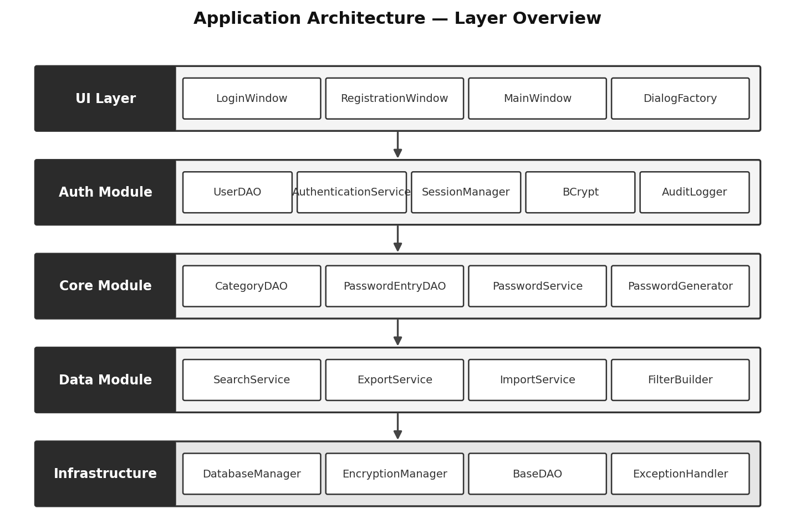

# Password Vault Desktop Application

A professional, role-based password management system designed for maximum security and modularity. This application implements industry-standard encryption protocols and a clean, persona-driven architecture.

---

## Architecture

This project was developed by redistributing logic across five distinct developer personas, each responsible for a critical layer of the application:

### 🏗️ Infrastructure & Database Architect
**Focus: Foundation, Database Schema, and Core Security**
- **SQLite Schema:** Designed a normalised database with indices for high-performance lookups.
- **AES-256 Encryption:** Implemented high-level password storage using the standard Java Cryptography Extension (JCE).
- **BaseDAO:** Created an abstract persistence layer for consistent data access.

### 🔐 Authentication & Security Specialist
**Focus: User Identity, Sessions, and BCrypt Hashing**
- **BCrypt Hashing:** Implemented salted password hashing for user accounts.
- **Session Management:** Developed a thread-safe singleton for tracking active user states.
- **Audit Logging:** Integrated a security event tracker that records every login/action.

### ⚙️ Core Password Core Development
**Focus: Business Logic, CRUD, and Generation**
- **Secure CRUD:** Developed the primary service for adding, viewing, and deleting sensitive entries.
- **Password Generator:** Integrated a cryptographically secure random password generator.
- **Model Design:** Crafted the `PasswordEntry` and `Category` data models with validation.

### 📊 Data Management & Reporting
**Focus: Advanced Search, Filtering, and Portability**
- **Search Engine:** Built a full-text search engine with relevance scoring (Website > Username).
- **Export/Import:** Created an encrypted custom file format for secure data migration.
- **Dynamic Filters:** Developed a builder for complex category and date-based filtering.

### 🖥️ UX/UI & Frontend Development
**Focus: Swing GUI, Responsive Design, and User Flow**
- **Modular Windows:** Designed specialised screens for Login, Registration, and the Main Dashboard.
- **UI Consistency:** Implemented a `DialogFactory` for unified styling and solid-coloured buttons.
- **Responsive Layouts:** Ensured a clean, intuitive experience across different window sizes.

---

## Application Layer Architecture



*Figure 1 — Application Layer Architecture*

---

## Security Implementation

| Layer | Technology | Purpose |
|---|---|---|
| User Auth | BCrypt | Irreversible hashing for master passwords. |
| Data Storage | AES-256 (JCE) | Encryption of website credentials. |
| Persistence | SQLite | Local, encrypted file-based database. |
| Integrity | PRAGMA Foreign Keys | Enforcing data relationships in the vault. |

---

## Getting Started

### Prerequisites
- JDK 1.8 or higher.
- Apache Maven 3.x.

### Installation

1. **Clone the repository:**
   ```bash
   git clone https://github.com/AanyaSingh-s/password-vault-desktop-application.git
   ```

2. **Navigate to the root directory:**
   ```bash
   cd "password vault desktop application"
   ```

3. **Build and Run:**
   ```bash
   mvn clean compile exec:java
   ```

### First-Time Use

- **Register:** Launch the app and click Register to create your local master account.
- **Login:** Enter your credentials to unlock the vault.
- **Manage:** Start adding your website credentials. Everything is encrypted on-the-fly.

---

## Authentication Flow


*Figure 2 — Authentication Flow (Login & Registration)*

---

## Password Entry Flow


*Figure 3 — Password Entry Flow (Add Credential)*

---

## Project Structure

```
src/main/java/com/passwordvault/
│
├── infrastructure/          # Foundation
│   ├── db/                  # Connection & Schema
│   ├── security/            # AES-256 Implementation
│   ├── data/                # BaseDAO Abstraction
│   └── exception/           # Error Handling
│
├── auth/                    # Security & Identity
│   ├── dao/                 # User Persistence
│   ├── service/             # Login / Registration
│   ├── security/            # BCrypt Logic
│   ├── logging/             # Audit Tracking
│   ├── session/             # Session Lifecycle
│   └── util/                # Password Validation
│
├── core/                    # Business Logic
│   ├── model/               # Core Data Models
│   ├── dao/                 # Password Entry Persist
│   └── service/             # Password Operations
│
├── data/                    # Reporting Layer
│   ├── service/             # Search / Export / Import
│   └── util/                # Advanced Filtering
│
└── ui/                      # Presentation Layer
    ├── LoginWindow.java      # Authentication screen
    ├── MainWindow.java       # Primary dashboard
    ├── DialogFactory.java    # UI utility factory
    └── PasswordVaultApp.java # Entry point
```
